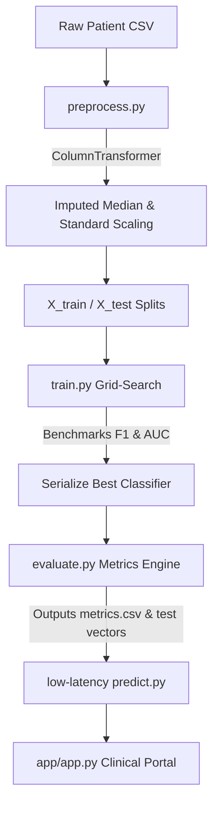

# 🫀 CardioVision AI — Clinical Diagnostics & Health Analytics Platform


CardioVision AI is a premium, recruiter-impressive cardiovascular disease diagnostics dashboard and cohort health analytics system. Designed to mirror a high-fidelity EHR (Electronic Health Record) clinical assistant, the application bridges robust machine learning model benchmarks with responsive, explainable clinical design systems.

---

## 🌟 Visual & Technical Highlights

* **Clinical Dark Mode UI**: Replaced standard templates with a customized design system using custom Google Fonts (`Plus Jakarta Sans`), glassmorphism cards, styled form controllers, and custom neon-teal and medical-coral glowing indicators.
* **Trained Multi-Model Pipeline**: Auto-evaluates SVM, Logistic Regression, Random Forest, Gradient Boosting, and XGBoost classifiers. The training engine serializes the highest performing model based on ROC-AUC curves.
* **Progressive Clinical Simulation**: Real-time diagnostic interface featuring modular simulation stages (*Baselines Extraction ➡️ Hemodynamics Tracking ➡️ Lipid Profiling ➡️ Inference Classification*), followed by responsive dark-styled gauge charts.
* **Local Explainable AI (XAI)**: Demystifies predictions for clinicians by breaking down exact physiological indicators (such as Hypertensive BP ranges, overweight body mass indices, physical activity status, or age coefficients) and mapping them to their direct risk impact.
* **Cohort Health Insights**: Interactive distribution tracking (Age pattern histograms, Systolic vs. Diastolic BP scatter clusters, and full-aspect correlation matrices mapped to teal-coral sequential gradients) with clinical annotations.
* **High-Fidelity Validation Portal**: Spacious tabbed layout containing live-calculated ROC Curves, annotated Confusion Matrices, and performance benchmarks directly derived from serialized validation sets.

---

## 🏗 Modular Architecture

```
codeaplha_diseaseprediction/
├── app/
│   └── app.py              # Upgraded Clinical Diagnostics Dashboard (UI/UX Core)
├── data/
│   └── raw/
│       └── cardio_dummy.csv # De-identified cohort EHR records
├── models/
│   ├── best_model.pkl      # Production classifier serialization
│   ├── preprocessor.pkl    # Fitted ColumnTransformer pipeline
│   ├── metrics.csv         # Computed training scores & AUC
│   ├── X_test.npy          # Serialized hold-out test inputs
│   └── y_test.npy          # Serialized hold-out test labels
├── src/
│   ├── preprocess.py       # ColumnTransformer engineering split scripts
│   ├── train.py            # Multi-algorithm grid search benchmark engine
│   ├── evaluate.py         # Test matrix performance analyzer
│   ├── predict.py          # Low-latency clinical inference interface
│   └── utils.py            # Core directory resolver
└── main.py                 # Pipeline orchestration entry point
```

---

## 🧬 Machine Learning Pipeline



1. **Feature Engineering Pipeline**: The data engine wraps numeric features into a `ColumnTransformer` that imputes missing data with robust median statistics and scales inputs to preserve scale-invariance. Categorical biometrics undergo isolated encoding to guarantee mathematically optimal coefficients.
2. **Optimal Classifier Selection**: Rather than hardcoding a single algorithm, `train.py` benchmarks five distinct algorithms, prioritizing the maximization of ROC-AUC and Recall (Sensitivity)—minimizing dangerous false negatives.
3. **Low-Latency Inference API**: Encapsulated within `src/predict.py`, the `CardioRiskPredictor` class provides a single, reusable API instance that pre-loads models and features, scaling user inputs to deliver predictive scores in milliseconds.

---

## 🚀 Installation & Running

### 1. Clone the Repository
```bash
git clone https://github.com/yourusername/cardiovision-ai.git
cd cardiovision-ai
```

### 2. Set Up Virtual Environment & Dependencies
```bash
python3 -m venv venv
source venv/bin/activate
pip install -r requirements.txt
```

### 3. Generate Mock Data & Execute Pipeline
To simulate a real clinical data engineering environment, generate the mock 1,000-patient EHR cohort and run the full grid-search training pipeline:
```bash
# Generate the de-identified CSV records
python generate_dummy_data.py

# Run preprocessing, model benchmark training, and model evaluation
python main.py
```
*This will train the models, select the highest-performing classifier, and export preprocessor pipelines and evaluation matrices directly to the `models/` directory.*

### 4. Launch the Streamlit Diagnostic Portal
```bash
streamlit run app/app.py
```
Open `http://localhost:8501` to view your premium clinical workspace!

---

## 🤝 Project Design & Aesthetics
This application was styled with a **"clinical-intelligence"** design ethos, drawing inspiration from modern medical SaaS systems rather than standard default templates:
* **Curated Palette**: Core surfaces are styled in dark navy (`#070913`) and obsidian charcoal (`#0E1225`), creating a high-contrast clinical interface.
* **Accent Indicators**: Warning thresholds are colored with a medical-coral accent (`#D74A53`), while normal metabolic ranges and baseline metrics are represented by a muted ocean teal (`#0D9488`).
* **Visual Stability**: Strict zero-indentation styling inside python multi-line templates ensures the Markdown engine never leaks code tags or `<pre>` blocks, displaying only flawless custom elements.

---

## 📄 License
This project is [MIT](https://choosealicense.com/licenses/mit/) licensed.

---
*Developed as a high-fidelity showcase portfolio piece to demonstrate robust ML production pipelines, Explainable AI concepts, and recruiter-impressive UI design.*
